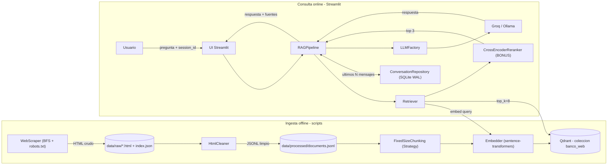

# Sistema RAG con Web Scraping — Prueba Técnica MLE

Asistente conversacional que responde preguntas sobre el sitio web público de un banco, usando un pipeline RAG (Retrieval-Augmented Generation) construido enteramente sobre herramientas gratuitas / open source: scraping propio, embeddings locales, Qdrant como vector DB, Groq como LLM (free tier) e interfaz en Streamlit.

## Índice

1. [Descripción y arquitectura](#descripción-y-arquitectura)
2. [Supuesto sobre el sitio del banco](#supuesto-sobre-el-sitio-del-banco)
3. [Requisitos previos](#requisitos-previos)
4. [Instalación y puesta en marcha (desde cero)](#instalación-y-puesta-en-marcha-desde-cero)
5. [Uso de la interfaz](#uso-de-la-interfaz)
6. [Patrones de diseño](#patrones-de-diseño)
7. [Stack tecnológico y justificación](#stack-tecnológico-y-justificación)
8. [Análisis de conversaciones (analytics)](#análisis-de-conversaciones-analytics)
9. [Estructura del proyecto](#estructura-del-proyecto)
10. [Cómo correr los tests](#cómo-correr-los-tests)
11. [Limitaciones y supuestos](#limitaciones-y-supuestos)
12. [Mejoras futuras](#mejoras-futuras)

## Descripción y arquitectura

El sistema tiene dos flujos claramente separados:

- **Ingesta offline** (se ejecuta una vez, bajo demanda, vía scripts): scrapea el sitio del banco respetando `robots.txt`, limpia el HTML a texto plano, lo trocea (chunking), genera embeddings y los indexa en Qdrant.
- **Consulta online** (Streamlit, siempre corriendo): recibe la pregunta del usuario, recupera los chunks más relevantes, los rerankea, arma el prompt con historial de conversación y consulta al LLM.



Servicios en Docker Compose (`docker-compose.yml`):

| Servicio | Imagen / build | Puerto | Rol |
|---|---|---|---|
| `qdrant` | `qdrant/qdrant:v1.10.1` | `6333` | Vector DB (dashboard en `http://localhost:6333/dashboard`) |
| `app` | `Dockerfile` (Python 3.11) | `8501` | UI Streamlit + scripts de ingesta (`docker compose exec app ...`) |

## Supuesto sobre el sitio del banco

La prueba pide scrapear el sitio de un banco. Se verificó que **BBVA Colombia (`https://www.bbva.com.co/`) prohíbe explícitamente el crawling en su `robots.txt`**. Como la prueba permite usar otro banco si el original bloquea el acceso, este proyecto usa por defecto:

```
SCRAPE_BASE_URL=https://www.bancolombia.com/
```

configurable vía variable de entorno. El scraper (`src/scraping/scraper.py`) **respeta `robots.txt`** de cualquier dominio que se configure (usa `urllib.robotparser`), así que si se apunta a un sitio que bloquea rutas, esas rutas simplemente no se visitan.

## Requisitos previos

- **Docker** y **Docker Compose** (plugin `docker compose`, no el binario legado `docker-compose`).
- **API key gratuita de Groq**: crear cuenta en [console.groq.com](https://console.groq.com), generar una API key y guardarla para el paso de configuración. Sin esta key el sistema **levanta y funciona igual** (scraping, indexado, búsqueda, UI), pero el chat devuelve un mensaje de error genérico al intentar generar la respuesta final, porque no hay LLM disponible.
- Puertos libres en el host: `8501` (UI) y `6333` (Qdrant).
- ~3 GB de espacio en disco libre (dependencias de ML + modelos predescargados en la imagen).

## Instalación y puesta en marcha (desde cero)

```bash
# 1. Clonar el repositorio
git clone <URL_DEL_REPOSITORIO> rag-banco
cd rag-banco

# 2. Crear el archivo de configuración a partir de la plantilla
cp .env.example .env

# 3. Editar .env y completar la API key de Groq
#    GROQ_API_KEY=gsk_xxxxxxxxxxxxxxxxxxxxxxxx
#    (el resto de valores por defecto ya funcionan)

# 4. Levantar Qdrant + la app (primer build: ~10-25 min)
docker compose up --build -d
```

Este único comando levanta todos los servicios (app + Qdrant); los scripts de scraping/indexado (pasos 6 y 7) son pasos de ingesta offline deliberadamente separados, no se ejecutan automáticamente al levantar el compose.

El primer build tarda porque instala `torch` (CPU-only) y predescarga los modelos de `sentence-transformers` (embeddings multilingües + cross-encoder reranker) dentro de la imagen, para que el contenedor arranque sin depender de red hacia Hugging Face. Builds siguientes son mucho más rápidos por el cacheo de capas de Docker.

```bash
# 5. Verificar que ambos servicios están arriba y sanos
docker compose ps

# 6. Ejecutar el scraper (descarga y limpia el sitio del banco)
docker compose exec app python -m scripts.run_scraper

# 7. Indexar los documentos limpios en Qdrant
docker compose exec app python -m scripts.run_indexer
```

El scraper deja el HTML crudo en `./data/raw/` y el texto limpio en `./data/processed/documents.jsonl` (montados como volumen desde el host). El indexer trocea esos documentos y sube los vectores a la colección `banco_web` en Qdrant.

Paso 8: abrir **http://localhost:8501** en el navegador y empezar a chatear.

```bash
# 9. (Opcional) Generar el reporte de analítica sobre el histórico de conversaciones
docker compose exec app python -m scripts.run_analytics
```

### Re-ejecutar el indexer

Los IDs de los puntos en Qdrant se generan con `uuid4()` (no deterministas), así que **volver a correr `run_indexer` duplica los puntos** en la colección en lugar de sobreescribirlos. Si necesitas reindexar desde cero:

```bash
curl -X DELETE http://localhost:6333/collections/banco_web
docker compose exec app python -m scripts.run_indexer
```

### Alternativa de LLM: Ollama (opción avanzada, no incluida en el compose)

Si no se quiere depender de un servicio externo, `src/rag/llm.py` incluye un `OllamaLLM` seleccionable con:

```
LLM_PROVIDER=ollama
LLM_MODEL=<modelo servido por tu Ollama>
```

Esto requiere correr un servicio Ollama accesible en la red de Docker Compose bajo el nombre de host `ollama` (puerto `11434`); **no está incluido en `docker-compose.yml`** por defecto — habría que añadir el servicio y ajustar `depends_on` en `app`. Se documenta como opción, no como parte del entregable base.

### Apagar el sistema

```bash
docker compose down       # detiene los contenedores, conserva los datos (volumen de Qdrant)
docker compose down -v    # además borra el índice de Qdrant (hay que reindexar después)
```

Con `docker compose down -v` se pierde únicamente el volumen de Qdrant (los vectores indexados); los datos scrapeados (`./data/raw`, `./data/processed`) y el historial de conversaciones (`conversations.db`) sobreviven porque están montados como bind mounts en `./data`, fuera del volumen gestionado por Compose.

## Uso de la interfaz

La UI (`src/app.py`) es un chat minimalista en Streamlit:

- **ID de sesión** (sidebar, campo de texto, valor por defecto `default`): identifica el hilo de conversación. Cambiar este valor permite tener conversaciones independientes con historial propio, persistidas en SQLite.
- **Chat**: campo de entrada al final de la página; el historial visible se recarga desde la base de datos (`get_last_n(session_id, n=50)`) en cada refresco.
- **Fuentes**: cada respuesta del asistente incluye un expander "Fuentes" con las URLs del sitio del banco usadas como contexto (deduplicadas, en el orden en que aportaron al ranking).
- **Historial enviado al LLM**: no se manda el hilo completo, sino los últimos `HISTORY_WINDOW_N` mensajes (por defecto `6`, configurable en `.env`), para acotar tokens y costo por request.

## Patrones de diseño

La prueba exige al menos 3 patrones documentados; se implementaron 5:

| Patrón | Dónde | Por qué |
|---|---|---|
| **Singleton** | `src/config.py` — `get_settings()` decorado con `@lru_cache` | Una única instancia de `Settings` (variables de entorno) compartida por todo el proceso, evitando releer/parsear el `.env` en cada uso y garantizando consistencia de configuración. |
| **Factory Method** | `src/rag/llm.py` — `LLMFactory.create()` | Desacopla al pipeline del proveedor concreto de LLM. Cambiar de Groq a Ollama es solo una variable de entorno (`LLM_PROVIDER`); el resto del código consume la interfaz `BaseLLM` sin saber cuál implementación recibió. |
| **Strategy** | `src/indexing/chunking.py` — `ChunkingStrategy` (`FixedSizeChunking`, `ParagraphChunking`) | El algoritmo de troceo de texto es intercambiable sin tocar el indexer. Permite comparar/ajustar estrategias de chunking (tamaño fijo con overlap vs. por párrafos) sin romper el resto del pipeline. |
| **Repository** | `src/memory/history.py` — `ConversationRepository` | Aísla el acceso a SQLite (queries, conexión, modo WAL) detrás de una interfaz de dominio (`add_message`, `get_last_n`, `all_messages`). El pipeline y la UI no conocen SQL ni el motor de persistencia subyacente. |
| **Adapter** | `src/indexing/vector_store.py` — `VectorStore` sobre `QdrantClient` | Expone una interfaz propia (`upsert`, `search`) sobre el cliente concreto de Qdrant, para poder sustituir la vector DB (p. ej. por otra self-hosted) sin tocar el retriever ni el indexer. |

## Stack tecnológico y justificación

Todo el stack es gratuito/open source, priorizando ejecución local sin dependencias de pago obligatorias:

| Componente | Elección | Justificación |
|---|---|---|
| Lenguaje | Python 3.11 (imagen `python:3.11-slim`) | Ecosistema maduro de ML/NLP y del stack RAG elegido. |
| Scraping | `requests` + `BeautifulSoup4` (+ `lxml`) | Simple, sin dependencias pesadas de navegador; suficiente para HTML estático; respeta `robots.txt` vía `urllib.robotparser`. |
| Embeddings | `sentence-transformers`, modelo `paraphrase-multilingual-MiniLM-L12-v2` | Gratuito, corre localmente (sin llamadas a API de pago), y es multilingüe — clave porque el contenido del banco está en español. |
| Vector DB | Qdrant self-hosted (Docker, `qdrant/qdrant:v1.10.1`) | Open source, corre en el mismo compose, sin costos de un servicio administrado; incluye dashboard web en `/dashboard` para inspección. |
| Reranker (BONUS) | `cross-encoder/ms-marco-MiniLM-L-6-v2` | Mejora la precisión del top-k final reordenando por relevancia real query-documento, más allá de la similitud de embeddings. |
| LLM | Groq, `llama-3.1-8b-instant` (free tier) | Free tier generoso, latencia muy baja, sin necesidad de GPU propia. Intercambiable por Ollama local vía Factory Method. |
| Historial | SQLite en modo WAL (`conversations.db`) | Cero configuración, persistente en disco (volumen `./data`), soporta concurrencia razonable para una app de un solo proceso Streamlit. |
| UI | Streamlit | Interfaz conversacional mínima "out of the box" (chat, sidebar, expanders) con muy poco código. |
| Tests | `pytest` (26 tests) | Estándar de facto en Python; cobertura de chunking, cleaner, config, history, llm, pipeline, retriever y analytics. |

## Análisis de conversaciones (analytics)

`scripts/run_analytics.py` lee **todo** el historial persistido en SQLite (todas las sesiones) y calcula métricas agregadas (`src/analytics/metrics.py`):

```bash
docker compose exec app python -m scripts.run_analytics
```

Salida (JSON por stdout):

- `total_sessions`: número de `session_id` distintos.
- `total_messages` / `user_messages`: volumen total de la conversación.
- `avg_messages_per_session`: promedio de mensajes por sesión.
- `avg_user_msg_length`: longitud promedio (caracteres) de las preguntas del usuario.
- `top_terms`: los 10 términos más frecuentes en las preguntas (con stopwords en español filtradas).
- `messages_per_day`: conteo de mensajes agrupados por fecha (UTC).

Esto da una idea de qué está preguntando la gente y con qué intensidad se usa el asistente, insumo típico para priorizar contenido a scrapear o ajustar el prompt del sistema.

## Estructura del proyecto

```
rag-banco/
├── docker-compose.yml
├── Dockerfile
├── requirements.txt
├── .env.example
├── pytest.ini
├── README.md
├── scripts/
│   ├── run_scraper.py       # scraping + limpieza (data/raw -> data/processed)
│   ├── run_indexer.py       # chunking + embeddings -> Qdrant
│   └── run_analytics.py     # métricas sobre el historial de conversaciones
├── src/
│   ├── config.py            # Settings (Singleton vía lru_cache)
│   ├── app.py                # UI Streamlit
│   ├── scraping/
│   │   ├── scraper.py        # WebScraper (BFS, robots.txt)
│   │   └── cleaner.py        # HtmlCleaner (HTML -> texto limpio)
│   ├── indexing/
│   │   ├── chunking.py        # ChunkingStrategy (Strategy)
│   │   ├── embedder.py        # Embedder (sentence-transformers)
│   │   └── vector_store.py    # VectorStore (Adapter sobre Qdrant)
│   ├── rag/
│   │   ├── retriever.py       # Retriever + CrossEncoderReranker
│   │   ├── llm.py             # BaseLLM, GroqLLM, OllamaLLM, LLMFactory
│   │   └── pipeline.py        # RAGPipeline (orquesta retrieve + historial + LLM)
│   ├── memory/
│   │   └── history.py         # ConversationRepository (Repository, SQLite WAL)
│   └── analytics/
│       └── metrics.py         # compute_metrics()
├── tests/                     # 26 tests (no se incluyen en la imagen Docker)
└── data/                      # creado en runtime, montado como volumen ./data
    ├── raw/                   # HTML crudo + index.json
    └── processed/             # documents.jsonl (texto limpio)
```

## Cómo correr los tests

Los tests **no están incluidos en la imagen Docker** (excluidos deliberadamente vía `.dockerignore`, junto con `.venv`, `.git*`, `*.md`, datos crudos/procesados y la base de conversaciones) para mantener la imagen de producción liviana. Se corren en un entorno local:

```bash
python -m venv .venv
source .venv/bin/activate        # En Windows: .venv\Scripts\activate

pip install -r requirements.txt
pytest
```

`pytest.ini` fija `pythonpath = .`, así que los tests importan `src` y `scripts` correctamente sin instalar el proyecto como paquete. Cobertura actual: 26 tests sobre chunking, cleaner, config, history, llm, pipeline, retriever y analytics.

## Limitaciones y supuestos

- **Sitio scrapeado**: se usa Bancolombia por defecto porque BBVA Colombia bloquea el crawling en `robots.txt` (ver [supuesto](#supuesto-sobre-el-sitio-del-banco)). `SCRAPE_BASE_URL` es configurable a cualquier otro dominio.
- **Cobertura del crawler**: BFS limitado al mismo dominio y a `SCRAPE_MAX_PAGES=50` páginas (configurable); no cubre todo el sitio, solo una muestra representativa acorde al alcance de la prueba.
- **Qdrant sin autenticación**: aceptable solo para un entorno local de prueba técnica (ver comentario en `docker-compose.yml`, línea del servicio `qdrant`); en un despliegue real requeriría API key/TLS.
- **Reindexado no idempotente**: los IDs de punto son `uuid4()` no deterministas, así que volver a correr `run_indexer` sin borrar la colección duplica los chunks (ver workaround con `curl -X DELETE` más arriba).
- **Dependencia de un servicio externo para el LLM**: con `LLM_PROVIDER=groq`, si Groq no está disponible o la API key es inválida/está vacía, el chat responde con un mensaje de error genérico (no falla la app, pero no hay respuesta generada).
- **`ParagraphChunking` no está en uso**: existe como estrategia alternativa (patrón Strategy) pero el pipeline de indexado usa `FixedSizeChunking` por defecto.
- **Sin evaluación automática de calidad RAG**: no hay métricas tipo groundedness/relevancia (ej. RAGAS) sobre las respuestas generadas, solo analítica descriptiva del uso.
- **Logging sin handler global**: los módulos usan `logging.getLogger(__name__)` pero no hay configuración centralizada de handlers/formato/nivel a nivel de aplicación; en Docker los logs llegan a stdout con el formato por defecto de Python.
- **Prompt injection no mitigado**: el contenido scrapeado (texto web no confiable) se inyecta directamente en el prompt del LLM como contexto — riesgo de prompt injection conocido y no mitigado en este alcance.

## Mejoras futuras

- Scraping incremental y programado (solo páginas nuevas/modificadas, en vez de recorrer todo el dominio cada vez).
- IDs de chunk deterministas (hash de `url` + posición) para que `run_indexer` sea idempotente sin necesidad de borrar la colección.
- Evaluación automática de calidad RAG (p. ej. RAGAS: faithfulness, context precision/recall).
- Streaming de tokens en la respuesta del LLM en la UI, en vez de esperar la respuesta completa.
- Autenticación/API key en Qdrant, incluso para el entorno de desarrollo.
- Panel visual de las métricas de `run_analytics` (dashboard en vez de JSON por stdout).
- Tests de integración con el LLM mockeado a nivel HTTP (en vez de solo unit tests con dobles de `BaseLLM`).
